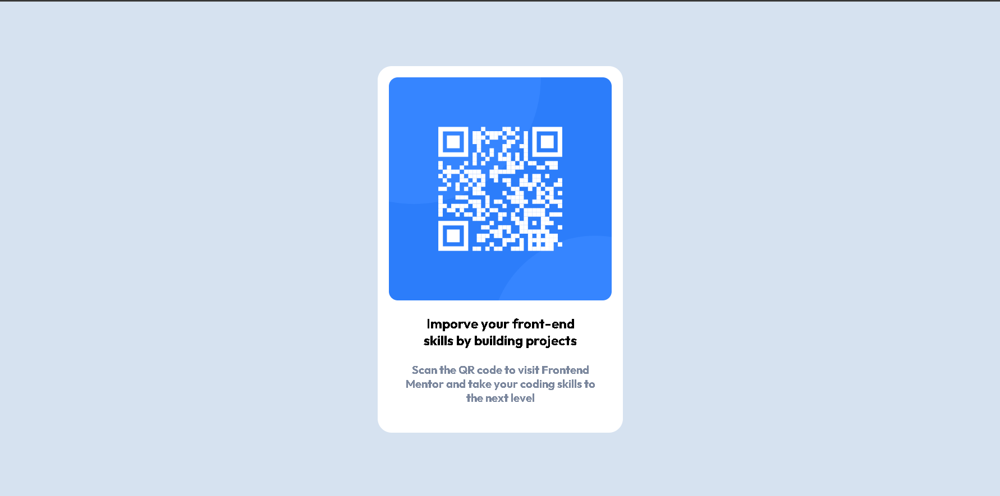

# Frontend Mentor - QR code component solution

This is a solution to the [QR code component challenge on Frontend Mentor](https://www.frontendmentor.io/challenges/qr-code-component-iux_sIO_H). Frontend Mentor challenges help you improve your coding skills by building realistic projects. 

## Table of contents

- [Overview](#overview)
  - [Screenshot](#screenshot)
  - [Links](#links)
  - [Built with](#built-with)
  - [What I learned](#what-i-learned)
  - [Useful resources](#useful-resources)
- [Author](#author)

## Overview
this is QR Code component showing my CSS3 And HTML5 Skills. 

### Screenshot




### Links

- Solution URL: [Solution Code](https://github.com/shubhu0767/QR-Code-Component)
- Live Site URL: [Live Websie](https://your-live-site-url.com)

### Built with

- Semantic HTML5 markup
- CSS custom properties
- CSS Grid
- Mobile-first workflow

### What I learned

I Learn a lot of things in this Mini Project. When i developing this pages i learn how grid works and how to center a div and Also Media Quaries for Mobile view Using media quaries we can make responsive design

For More details See Below Code

```html
<h1>Some HTML code I'm proud of</h1>
```
```css
.section {
      display: grid; place-content: center;
      height: 100vh;
      background-color: hsl(212, 45%, 89%);
    }

@media screen and (min-width: 375px) {
      .qr-code {
        width: 350px;
        
      }
      img {
        width: 318px;
      }
      p {
        margin-bottom: 2.5rem;
      }
}
```

### Useful resources

- [Resource 1](https://chrome.google.com/webstore/detail/window-resizer/kkelicaakdanhinjdeammmilcgefonfh) - This extension helped me for when i write Mobile Screen Code. I really liked this Extension and will use it going forward.
- [Resource 2](https://www.w3schools.com/css/css_grid.asp) - This is an amazing article which helped me finally understand Grid property and other properties of CSS3. I'd recommend it to anyone still learning this concept.

## Author
- Frontend Mentor - [@shubhu0767](https://www.frontendmentor.io/profile/shubhu0767)